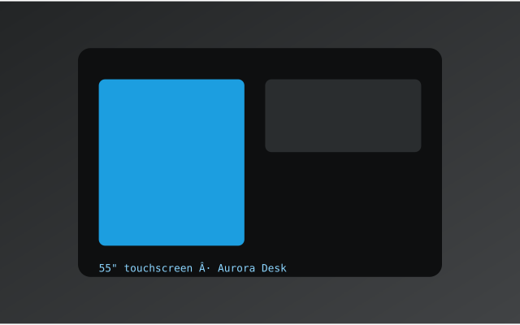

# Blocks Markdown — Format Spec

> **Status:** Working spec v2 (2026-09-08). The durable authoring format for content that maps onto the CMS
> block tree (sections → blocks | columns), readable to humans **and** authorable by LLMs.
> Companion: `../../../../cms-migration-plan.md`; showcase: `showcase.md` + `showcase.html`.
> Supersedes `../../../../../_Archive/blocks-markdown-spec-v1.md`.

---

## 1. Purpose

Make a structured document (the CMS's `{ sections: [...] }` tree) authorable in **plain markdown** that:

- is **readable** — content reads like a normal document, not JSON or scaffolding;
- is **portable** — renders correctly in GitHub / VS Code preview (the structural markers are invisible);
- is **LLM-emitable** — guessable without the spec: one grammar, markdown conventions, no surprises;
- doubles as a **slideshow** source (each section = a slide).

## 2. Design principles

1. **Content is implicit; structure is explicit.** Bare markdown = content blocks. Directives (invisible HTML
   comments) = structure + data.
2. **Invisible everywhere.** All structure/data carriers are HTML comments (`<!-- … -->`), which GitHub,
   VS Code and browsers never render. The document body stays pure markdown.
3. **One grammar.** Every directive has the same shape: `kind` + optional first-line shorthand + optional
   line-based fields. There is no per-directive syntax to learn.
4. **Flow closes implicitly; containers close explicitly.** Sections, media and vars end "at the next one"
   (like markdown headings). Only `columns` — the one true container — has a close tag, `<!-- /columns -->`.
5. **Blank line after images.** A media image is always followed by `\n\n`, so generic renderers never merge
   trailing text into the image's paragraph.
6. **Small fixed vocabulary.** `document | section | media | columns | col | var`. Growth happens in
   attributes, not in new directives.
7. **Directives never carry content or presentation.** Every directive maps to a CMS block type; class hooks
   and structural data only, never text, never style. This is the line that keeps the format from becoming HTML.

## 3. The directive grammar

Every directive is an HTML comment of the form:

```
<!-- kind [shorthand]
  field: value
  field: value
-->
```

- **kind** — one of the six vocabulary words (first token, required).
- **shorthand** — tokens on the first line after the kind: `key=value` pairs and the `kind:N` count form.
  For the common cases the shorthand is all you need: `<!-- media class="hero" -->`.
- **fields** — line-based `key: value` pairs on the following lines. Values may be scalars, `[a, b]` flow
  arrays, or `{ k: v }` inline maps.

**Shorthand and fields parse to the same attribute map.** The two forms below are identical:

```md
<!-- media class="hero" -->

<!-- media
  class: hero
-->
```

Shorthand is sugar for the 90% case; fields are the unbounded form (structured data, many keys). If a key
appears in both, the field wins. Whatever form an author (human or LLM) imitates, it parses — there is no
wrong style.

## 4. The vocabulary

### 4.1 `document` — metadata

Fields-only directive (no shorthand), conventionally at the top of the file:

```md
<!-- document
  title: Aurora Desk
  customer: Aurora Systems
  year: 2026
  categories: [Video Production, Motion Design]
  involvement: { concept: 60, programming: 100, motion: 80 }
  cover: hero.svg
-->
```

Replaces YAML frontmatter — which, unlike a comment, is only detected at the document top and is
position-locked. As a comment it can live anywhere and is stripped by every preview.

### 4.2 `section` — or a `#` heading

A section is opened by **either** a top-level `#` heading **or** an explicit directive:

```md
# Aurora Desk

<!-- section title="The Product Tour" class="dark" -->
```

- A `# ` heading at column 0 starts a new section; its text is the section's `label`.
- The explicit form carries metadata (`class`, `bg`, …) for slides / themed regions.
- `##`/`###` headings **within** a section are content (h2/h3), **not** new sections.
- Sections close **implicitly**: the next `#` heading or `section` directive ends them.

### 4.3 `media` — binds the next image

```md
<!-- media class="hero" -->

```

With structured fields, for anything a CMS media block carries:

```md
<!-- media
  class: hero
  focal: { x: 0.5, y: 0.3 }
  variants: [mobile, desktop]
  alt: Aurora kiosk in showroom
-->

```

- The directive declares the block; the following `` line is the media reference.
- `src` is a **reference** (path or media `_id`); variant resolution happens at render, not in the doc.
- **A blank line after the image is mandatory.** Without `\n\n`, markdown renderers merge trailing text
  into the image's paragraph and it inlines next to the image in preview.

### 4.4 `columns` / `col` — the layout container

```md
<!-- columns:2 class="product" -->
<!-- col -->
## The kiosk
prose… list…

<!-- col -->


<!-- /columns -->
```

- `<!-- columns:N … -->` opens a grid of N columns. `N` is part of the shorthand (`columns:2`, `columns:3`).
- Each `<!-- col -->` starts the next column slot; content accumulates into it until the next `col` or
  the close tag.
- `<!-- /columns -->` closes the region. **This is the only close tag in the format** — `columns` is a
  container, everything else is flow.
- Attributes beyond N (e.g. `class`, a proposed `split="2:1"` weighting) are structural data for the
  renderer, mapped to grid behavior — never inline style.
- The col count **must equal N** (see validation).
- Nesting `columns` inside `columns` is grammatically possible; whether the CMS schema uses it is a
  schema decision, not a format limitation.

### 4.5 `var` — named data, in three forms

A `var` directive binds a **name** to a value. Vars are data — never rendered as page content; the
renderer decides where they surface (CTA, settings panel, slideshow config).

Inline, for one-liners:

```md
<!-- var:link=https://aurora.example.com/desk -->
```

Two-line, for readability:

```md
<!-- var:cta -->
Book a showroom demo
```

Fenced, for structured data — the markdown fence bounds the value, the fence language declares the type:

````md
<!-- var:config -->
```json
{
  "theme": "dark",
  "autoplay": true,
  "loop_seconds": 30
}
```
````

The fenced form is the format's CDATA: the value can contain anything, and in generic previews it renders
as a normal syntax-highlighted code block — not invisible, but genuinely readable.

### 4.6 Content — everything else

Ordinary markdown, type inferred by the parser (`text`/`richtext`):

- paragraphs, `**bold**`, `*italic*`, `~~strike~~`
- `##`/`###` headings (inside a section)
- lists, nested lists, task lists `- [x]`
- blockquotes, tables (GFM), fenced code blocks, inline code, links, horizontal rules

No directive needed.

## 5. Scoping rules

Two scope models, both borrowed from markdown conventions:

| Model | Applies to | Rule |
|-------|-----------|------|
| **Flow** | `document`, `section`, `media`, `var` | valid until the next directive of a kind that ends it — the way a markdown heading's section ends at the next heading |
| **Container** | `columns` | explicit open and close: `<!-- columns:N -->` … `<!-- /columns -->` |

- `col` is only meaningful inside a `columns` region; a `col` ends at the next `col` or at `/columns`.
- Indentation is **cosmetic** — for human eyes only; the parser ignores it.
- The close tag exists because a container's end cannot be inferred from flow ("ends at the next non-col
  directive" was v1's rule, and the source of its worst failure modes). One explicit line removes the
  ambiguity class entirely — the same trade markdown makes with fenced code blocks.

## 6. Validation (fail loud, don't guess)

The parser must enforce, and reject on violation:

| Rule | Enforced condition |
|------|--------------------|
| unclosed `columns` | error at section boundary or EOF, with exact location |
| `col` placement | `col` only valid inside a `columns` region |
| col count | number of `col` slots **must equal N** |
| unknown directive | **error** — never silently dropped, never guessed |
| `var` value | a `var:<name>` must bind an inline value, a next-line value, or a fenced block |
| image blank line | media image must be followed by `\n\n` (mandatory formatting rule) |

## 7. Rendering behavior

- **Generic markdown (GitHub / VS Code preview):** all `<!-- … -->` are stripped → **readable content only**.
  Column content stacks vertically; fenced vars show as code blocks. No broken output, ever.
- **`nui-blocks`:** parses the comments into the block tree, then renders grids, themed sections, media
  variants, and surfaces vars.
- Reference target: `showcase.md` (source) and `showcase.html` (hand-built desired output),
  covering all layout patterns in one document.

## 8. Mapping to the CMS block tree

| markdown | CMS tree |
|----------|----------|
| `<!-- document … -->` | page-level metadata (`name`, `customer`, `year`, …) |
| `# heading` / `<!-- section … -->` | `section { label, class, … }` |
| bare markdown | `block { type: text|richtext }` (content inferred) |
| `<!-- media … -->` + image | `block { type: media, data: [reference], attrs }` |
| `<!-- columns:N -->` + `<!-- col -->` | `columns { columns: [ [block…], … ], attrs }` |
| `<!-- var:name -->` + value | `block { type: vars }` (data, not rendered) |

## 9. Non-goals (the HTML line)

The format becomes HTML the moment directives carry content or presentation. Refused by policy:

- no element-per-semantic vocabulary growth (six words, frozen);
- no style attributes (`color`, `width`, `font` — class hooks and structural data only);
- no grouping-for-grouping's-sake (a non-column wrapper block would need a new container kind and a
  second close tag — only add when the CMS schema actually demands it).

The test for any proposed extension: **does it map to a CMS block type, with content staying markdown?**
If not, it doesn't belong in the format.

## 10. Known limits / open decisions

- **Plain preview shows content, not layout** (columns don't grid in GitHub/VS Code). Expected; layout
  requires `nui-blocks`.
- **`split` column weighting** (`columns:2 split="2:1"`) is demonstrated in the showcase but provisional —
  may be absorbed into `class` hooks + renderer conventions instead.
- **Media references** resolve at render; the doc carries only the handle.
- **No group concept.** The CMS tree has `sections → groups → blocks`; the format's only grouping is
  `columns`. Add a group container only when a real page needs it (see §9).
- **Pandoc/MyST kinship**: `columns`/`col`/`class` mirror `:::` fenced divs, but comment-based to stay
  invisible in plain renderers.
