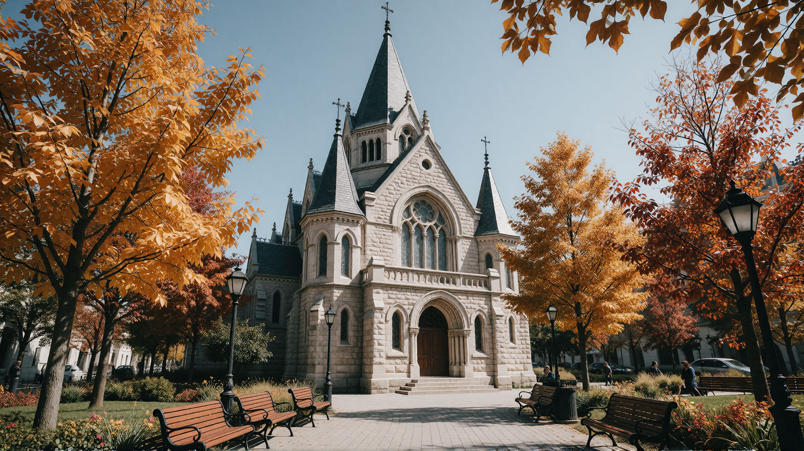
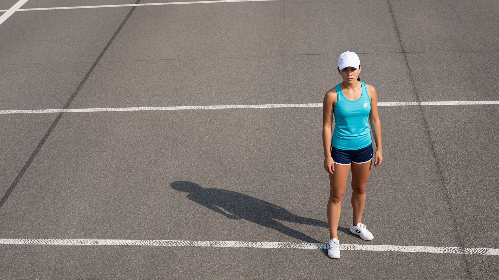

# Mara Voss

<!-- mb:block id=opening preset=lead label="Opening statement" -->
A working portfolio for a landscape photographer who chases the quiet hours across northern Europe.
Each image is printed large, each print is numbered, and the studio keeps a small archive of the light
that made them.

This page is a portfolio in the same format as a product brief: plain Markdown at the source, and the
enhanced renderer gives it a hero, a split, and a gallery.
<!-- mb:/block -->

<!-- mb:block id=hero kind=image preset=hero focal={"x":0.5,"y":0.32} label="Cover ridgeline" -->


**The signature image:** a thin ridge holding its last shadow as the light turns.
<!-- mb:/block -->

---

# In the field

The studio works from a single base but travels far for the right weather. Most frames are made on foot,
carried in a small pack, and kept only when the light is doing something the place has not done before.

<!-- mb:columns id=about-split weights=[2,1] label="Story and details" -->
<!-- mb:col label="About the work" -->
## A slow practice

Mara shoots on film and digital in equal measure, and prefers a tripod to a fast lens. The subjects are
largely unmoving — ice, stone, water, weather — so the work is really about patience and the willingness
to wait a full season for a single hour.

1. Scout a location in low season.
2. Return when the weather turns.
3. Keep the frame simple and let the light do the rest.


The photograph above is ordinary Markdown inside the column: it needs no directive of its own, only the
column it lives in.

<!-- mb:col preset=card label="Studio details" -->
## At a glance

| Detail | Choice |
|---|---|
| Focus | Alpine landscapes |
| Base | Tromsø, Norway |
| Years active | 2014–present |
| Print size | 30 × 40 in |

**Constraint:** every print is made to hang in daylight without glare.
<!-- mb:/columns -->

---

# Selected prints

A block that opens with a list of images is one gallery. Each image keeps its own alternative text, and
the caption at the end belongs to the whole collection rather than any single frame.

<!-- mb:block id=selected-prints kind=image preset=gallery label="Selected work" -->
- 
- 
- 
- 

**Four seasons, one practice.** The prints are shown in the order the studio prefers to hang them, not in
the order they were made.
<!-- mb:/block -->

When a single photograph needs its own story or crop, it gets its own block rather than a list item.

---

<!-- mb:section id=exhibition preset=dark label="Current exhibition" -->
<!-- mb:var name=seconds value=18 -->

# Now showing

This section carries its own timing data. The `seconds` variable belongs only to this section and does
not affect any other part of the portfolio.

<!-- mb:block id=exhibition-note preset=note label="Exhibition note" -->
### Note: the print wall

The current wall is a single long run of highland and glacier work, printed at 30 × 40 inches and hung in
a continuous line. Visitors are asked to move slowly; the room is arranged to be read, not skimmed.
<!-- mb:/block -->

<!-- mb:block id=exhibition-warning preset=warning label="Edition warning" -->
### Warning: limited editions

Each print is limited to an edition of twenty and is signed once it has been made. Once an edition sells
out, the photograph retires from the portfolio and returns to the studio archive.
<!-- mb:/block -->

---

<!-- mb:var name=transition -->
```json
{
  "type": "fade",
  "seconds": 0.8
}
```

# A closing note

<!-- mb:block id=colophon-note preset=note label="Contact" -->
### Contact the studio

Enquiries about prints, commissions, and the small archive of unprinted work are handled directly by the
studio. The studio replies to most messages within a week, and prefers a short note about the specific
photograph over a general one.
<!-- mb:/block -->

Document data lives in the frontmatter, section data lives in `var`, and the structure is a handful of
directives around ordinary Markdown.
